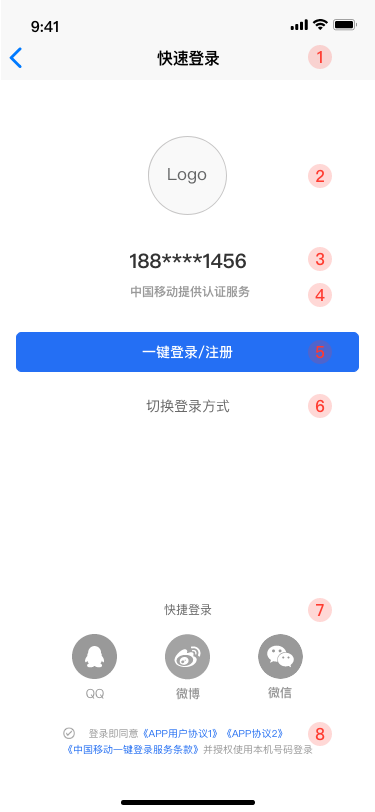

* [更新日志](#0-更新日志)
* [1. SDK接入流程](#1-sdk接入流程)
  * [1.1 添加SDK至项目](#11-添加SDK至项目)
  * [1.2 权限申请](#12-权限申请)
* [2. 一键登录功能](#2-一键登录功能)
  * [2.1 SDK初始化](#21-sdk初始化)
  * [2.2 一键登录](#22-一键登录)
  * [2.3 自定义授权界面的UI属性](#23-自定义授权界面的ui属性)
  * [2.4 添加自定义登录方式](#24-添加自定义登录方式)
  * [2.5 api](#25-api)
* [3. 本机号码验证功能](#3-本机号码验证功能)
  * [3.1 SDK初始化](#31-SDK初始化)
  * [3.2 本机号码验证](#32-本机号码验证)
  * [3.3 api](#33-api)
* [4 混淆keep规则](#4-混淆keep规则)
* [5 常见错误码](#5-常见错误码)


体验Demo下载


安装密码:  0000

若二维码失效则点击链接 [下载链接 ](https://www.pgyer.com/6uXk)

<font color="#ff0000">注意事项：</font>

- <font color="#ff0000">使用一键登录需要用户打开蜂窝数据网络</font>
- <font color="#ff0000">取号认证过程需要消耗少量用户数据流量</font>
- <font color="#ff0000">OPPO手机用户首次使用一键登录时需要手动切换到移动数据网络，授予接入方APP访问移动数据网络权（OPPO手机操作系统存在移动数据网络权限，在WIFI和数据网络同时打开时，应用首次打开默认使用WIFI数据通道，且无法通过SDK强制切换到数据网络取号，最终导致取号失败。）</font>


### 更新日志

| 版本号 | 更新说明                                                     | 更新时间   |
| :----- | :----------------------------------------------------------- | :--------- |
| v1.2.0 | 1. 新增授权界面UI定制方法（状态栏，隐私栏等等）<br>2. android.permission.READ_PHONE_STATE改为非必须权限 | 2019.12.11 |
| v1.1.2 | 1. 提升SDK的安全性，稳定性<br>2. 增加错误信息上报<br>3. 修复bug | 2019.11.19 |

### 1. SDK接入流程

#### 1.1 添加SDK至项目

接入环境： AndroidStudio

将Demo中libs目录下的两个aar文件拷贝至工程的libs目录下，然后在app的build.gradle进行以下配置

```groovy
android {
    ...
    //加载aar包需要
    repositories {
        flatDir {
            dirs 'libs'
        }
    }
}

dependencies {
 	....

    // json解析库(必须)
    implementation 'com.alibaba:fastjson:1.2.32'
    // 艾狄墨搏公共组件库(使用艾狄墨搏广告SDK时可不依赖，其余情况必须)
    implementation(name: 'common-release', ext: 'aar')
    // 一键登录SDK
    implementation(name: 'onekeylogin-release', ext: 'aar')
}

```

<font color="#ff0000"> 注意事项： 在同时接入一键登录和[艾狄墨搏广告SDK](http://101.37.118.54/dokuwiki/doku.php?id=admobgensdk)时，若发生依赖冲突，可移除common-release.aar这个库依赖(广告SDK必须升级至v2.3.12版本及以上)。</font>

#### 1.2 权限申请

若出现权限相关问题，请检查APP的权限是否申请正常。正常引用aar，权限会自动merge。若权限没有merge，需要添加如下权限。

```xml
<uses-permission android:name="android.permission.INTERNET" />
<uses-permission android:name="android.permission.READ_PHONE_STATE" />
<uses-permission android:name="android.permission.ACCESS_WIFI_STATE" />
<uses-permission android:name="android.permission.ACCESS_NETWORK_STATE" />
<uses-permission android:name="android.permission.CHANGE_NETWORK_STATE" />
```

<font color="#ff0000"> 注：确保以上权限正常申请，否则无法使用一键登录</font>

### 2. 一键登录功能

#### 2.1 SDK初始化

SDK只需在未登录前初始化，所以调用前需判断用户是否登录，避免频繁预取号，建议在Activity或者Fragment的onCreate中初始化。

```java
YuYanOneKeyLoginSDK.init(this, "申请的appid", new SDKInitResultCallback() {
    @Override
    public void onSuccess(YuYanOneKeyLogin oneKeyLogin) {
        //初始化成功后才能去调用一键登录
    }

    @Override
    public void onFailed(String error) {
    }
});
```

<font color="#ff0000">注： 申请的appid与包名和应用签名绑定，运行时需用应用签名对应用进行签名，否则无法调起一键登录</font>

#### 2.2 一键登录

在初始化成功后，便可调用一键登录方法。第一个参数为获取凭证的超时时间，单位ms。注意获取token成功后，需要开发者手动调用finishAuthPage方法关闭授权页。finishAuthPage方法必须在主线程中调用。

```java
mOneKeyLogin.getLoginToken(5000, new OnOneKeyLoginCallback() {
    @Override
    public void onShowAuthPageSuccess() {
        // 显示授权界面成功
    }

    @Override
    public void onTokenSuccess(String token) {
        // 获取token成功，需将token上报至服务端
    }

    @Override
    public void onTokenFailed(String error) {
        // 获取token失败
    }
  
  	@Override
    public void onCancel() {
    		//取消登录
    }
});
```

#### 2.3 自定义授权界面的UI属性





方法

```java
/**
 * 一键登录授权页面配置
 *
 * @param authUIConfig 布局配置
 */
public void setAuthUIConfig(AuthPageUiConfig config)

```

```java
/**********************①导航栏*******************************/
    /**
     * 导航栏主题颜色
     *
     * @param navColor
     * @return
     */
    public AuthPageUiConfig setNavColor(int navColor)

    /**
     * 导航栏标题文字内容
     *
     * @param navText
     * @return
     */
    public AuthPageUiConfig setNavText(String navText)

    /**
     * 导航栏标题文字大小 sp
     *
     * @param navTextSize
     * @return
     */
    public AuthPageUiConfig setNavTextSize(int navTextSize)


    /**
     * 导航栏标题文字颜色
     *
     * @param navTextColor
     * @return
     */
    public AuthPageUiConfig setNavTextColor(int navTextColor)

    /**
     * 导航栏返回键图片缩放类型
     *
     * @param navReturnScaleType
     * @return
     */
    public AuthPageUiConfig setNavReturnScaleType(ImageView.ScaleType navReturnScaleType)

    /**
     * 导航栏返回键图片路径
     *
     * @param path drawable下的图片
     * @return
     */
    public AuthPageUiConfig setNavReturnImgPath(String path)


    /**********************②logo区*******************************/

    /**
     * logo图片路径
     *
     * @param path drawable下的图片，例如 ic_launcher
     * @return
     */
    public AuthPageUiConfig setLogoImgPath(String path)

    /**
     * logo是否隐藏
     *
     * @param isHidden
     * @return
     */
    public AuthPageUiConfig setLogoHidden(boolean isHidden)

    /**
     * logo宽度
     *
     * @param width 宽度(dp)
     * @return
     */
    public AuthPageUiConfig setLogoWidth(int width)


    /**
     * logo高度
     *
     * @param height 高度(dp)
     * @return
     */
    public AuthPageUiConfig setLogoHeight(int height)

    /**
     * logo相对于导航栏顶部的位移
     *
     * @param offsetY
     * @return
     */
    public AuthPageUiConfig setLogoOffsetY(int offsetY)

    /**
     * logo相对于底部的位移
     *
     * @param offsetY
     * @return
     */
    public AuthPageUiConfig setLogoOffsetY_B(int offsetY)


    /**********************③掩码栏*******************************/

    /**
     * 设置掩码字体颜色
     *
     * @return
     */
    public AuthPageUiConfig setNumberColor(int color)

    /**
     * 设置掩码字体大小
     *
     * @return sp
     */
    public AuthPageUiConfig setNumberSize(int textSize)


    /**
     * 设置掩码控件相对于导航栏顶部的位移
     *
     * @return sp
     */
    public AuthPageUiConfig setNumFieldOffsetY(int offsetY)


    /**
     * 设置掩码控件相对于底部的位移
     *
     * @return sp
     */
    public AuthPageUiConfig setNumFieldOffsetY_B(int offsetY)


    /**********************④slogan*******************************/

    /**
     * slogan文字内容
     *
     * @param text
     * @return
     */
    public AuthPageUiConfig setSloganText(String text)

    /**
     * slogan文字颜色
     *
     * @param color
     * @return
     */
    public AuthPageUiConfig setSloganTextColor(int color)

    /**
     * slogan文字大小
     *
     * @param textSize (sp)
     * @return
     */
    public AuthPageUiConfig setSloganTextSize(int textSize)

    /**
     * slogan相对于导航栏顶部的位移
     *
     * @param offsetY (dp)
     * @return
     */
    public AuthPageUiConfig setSloganOffsetY(int offsetY)

    /**
     * slogan相对于底部的位移
     *
     * @param offsetY_B (dp)
     * @return
     */
    public AuthPageUiConfig setSloganOffsetY_B(int offsetY_B)

    /**
     * slogan 隐藏
     *
     * @param isHidden
     * @return
     */
    public AuthPageUiConfig setSloganHidden(boolean isHidden)


    /**********************⑤登录按钮*******************************/

    /**
     * 设置登录按钮文字内容(文字必须包含登录或者注册字眼)
     *
     * @param text
     * @return
     */
    public AuthPageUiConfig setLogBtnText(String text)

    /**
     * 设置登录按钮文字颜色
     *
     * @param textColor
     * @return
     */
    public AuthPageUiConfig setLogBtnTextColor(int textColor)

    /**
     * 设置登录按钮文字大小
     *
     * @param textSize sp
     * @return
     */
    public AuthPageUiConfig setLogBtnTextSize(int textSize)


    /**
     * 设置登录按钮背景图路径 (drawable目录下)
     *
     * @param path
     * @return
     */
    public AuthPageUiConfig setLogBtnBackgroundPath(String path)

    /**
     * 设置登录按钮具体顶部的位移 dp
     *
     * @param offsetY
     * @return
     */
    public AuthPageUiConfig setLogBtnOffsetY(int offsetY)

    /**
     * 设置登录按钮距离底部的位移 dp
     *
     * @param offsetY
     * @return
     */
    public AuthPageUiConfig setLogBtnOffsetY_B(int offsetY)


    /**********************⑥ 切换按钮*******************************/

    /**
     * 设置切换按钮是否可见
     *
     * @param isHidden
     * @return
     */
    public AuthPageUiConfig setSwitchAccHidden(boolean isHidden)


    /**
     * 设置切换按钮文字大小 sp
     *
     * @param textSize
     * @return
     */
    public AuthPageUiConfig setSwitchAccTextSize(int textSize)


    /**
     * 设置切换按钮文字
     *
     * @param text
     * @return
     */
    public AuthPageUiConfig setSwitchAccText(String text)

    /**
     * 设置切换按钮文字颜色
     *
     * @param color
     * @return
     */
    public AuthPageUiConfig setSwitchAccTextColor(int color)

    /**
     * 设置切换按钮距离顶部的位移 dp
     *
     * @param offsetY
     * @return
     */
    public AuthPageUiConfig setSwitchOffsetY(int offsetY)

    /**
     * 设置切换按钮距离底部的位移 dp
     *
     * @param offsetY
     * @return
     */
    public AuthPageUiConfig setSwitchOffsetY_B(int offsetY)


    /**********************⑧协议栏*******************************/
    /**
     * 自定义第一条隐私协议
     *
     * @param name 协议名
     * @param url  链接
     * @return
     */
    public AuthPageUiConfig setAppPrivacyOne(String name, String url)

    /**
     * 自定义第二条隐私协议
     *
     * @param name 协议名
     * @param url  链接
     * @return
     */
    public AuthPageUiConfig setAppPrivacyTwo(String name, String url)

    /**
     * 设置隐私条款文字颜色
     *
     * @param normalTextColor 基础文字颜色
     * @param protocolColor   协议文字颜色
     * @return
     */
    public AuthPageUiConfig setAppPrivacyColor(int normalTextColor, int protocolColor)

    /**
     * 隐私协议基础文字颜色
     *
     * @param color
     * @return
     */
    public AuthPageUiConfig setProtocolColor(int color)


    /**
     * 设置隐私条款距离顶部的位移 dp
     *
     * @param offsetY
     * @return
     */
    public AuthPageUiConfig setPrivacyOffsetY(int offsetY)

    /**
     * 设置隐私条款距离底部的位移 dp
     *
     * @param offsetY
     * @return
     */
    public AuthPageUiConfig setPrivacyOffsetY_B(int offsetY)

    /**
     * 隐私协议是否默认勾选
     *
     * @param isCheck
     * @return
     */
    public AuthPageUiConfig setPrivacyState(boolean isCheck)

    /**
     * 隐私协议复选框是否隐藏
     *
     * @param isHidden
     * @return
     */
    public AuthPageUiConfig setCheckboxHidden(boolean isHidden)

    /**
     * 设置复选框未选中时的图片
     *
     * @param path
     * @return
     */
    public AuthPageUiConfig setUncheckedImgPath(String path)


    /**
     * 设置复选框选中时的图片
     *
     * @param path
     * @return
     */
    public AuthPageUiConfig setCheckedImgPath(String path)

    /**
     * 设置协议的位置
     *
     * @param gravity
     * @return
     */
    public AuthPageUiConfig setProtocolGravity(int gravity)
```

#### 2.4 添加自定义登录方式

上图中区域⑦为自定义控件区，在该区域添加自定义控件。在调用**getLoginToken**请求之前，都需重新设置**AuthCustomViewConfig**，因为在授权页关闭时都会清空注入进去的 **AuthCustomViewConfig** ，具体实现请见 **demo** 工 程 

```java
mOneKeyLogin.addAuthCustomViewConfig("loginTypeView", /* 自定义控件名称*/
                  new AuthCustomViewConfig(addView, /* 开发者传入的自定义控件, SDK目前只支持RelativeLayout,需设置自定义控件的LayoutParams */                                         AuthCustomViewConfig.RootViewId.ROOT_VIEW_ID_BODY)); /* 设置控件位置 */
mOneKeyLogin.getLoginToken(5000, new OnTokenResultCallback() {
    ...   
}
```

目前SDK授权页允许在两个位置插入开发者自定义的控件

```java
public static final int ROOT_VIEW_ID_BODY = 0; // 授权页空白处
public static final int ROOT_VIEW_ID_TITLE_BAR = 1; // 标题栏
```

#### 2.5 api

YuYanOneKeyLogin : SDK初始化

```java
public class YuYanOneKeyLogin {
   
   /**
     * SDK初始化接口，预取号有效期为60 min
     *
     * @param context
     * @param appId    分配的应用id
     * @param callback
     */
    public static void init(final Context context, String appId, SDKInitResultCallback callback);
    
     /**
     * SDK初始化接口
     *
     * @param context
     * @param appId       分配的应用id
     * @param overdueTime 预取号预有效期 单位min
     * @param callback
     */
    public static void init(final Context context, String appId, final int overdueTime, SDKInitResultCallback callback);
    
}
```

YuYanOneKeyLogin 一键登录

```java
public class YuYanOneKeyLogin {
    
    /**
     * 唤起一键登录，用户授权后返回一键登录的token
     *
     * @param timeout  超时时间
     * @param callback
     */
    void getLoginToken(int timeout, OnOneKeyLoginCallback callback);


    /**
     * 设置SDK是否debug模式运行
     *
     * @param isDebug true则输出关键步骤运行日志
     */
    void setDebugMode(boolean isDebug);


    /**
     * 关闭授权页(必须在主线中调用)
     */
    void finishAuthPage();
    
     /**
     * 修改授权页面主题，开发者可以通过 此方法修改授权页面主题
     * 需在 getLoginToken接口之前调用
     * 注意：设置图片背景函数只需要填入图片的名称，无需后缀与路径
     * 并且图片需要放置drawable目录下
     *
     * @param config
     */
    void setAuthUIConfig(AuthPageUiConfig config);


    /**
     * 添加自定义控件区
     * 每次调用getLoginToken请求之前，都需重新设置AuthCustomViewConfig
     * @param name   开发者自定义的控件名称
     * @param config 自定义控件配置
     */
    void addAuthCustomViewConfig(String name, AuthCustomViewConfig config);
    
    /**
     * 退出后销毁
     */
    void onDestroy();
}
```

### 3. 本机号码验证功能

#### 3.1 SDK初始化

```java
YuYanOneKeyLoginSDK.initMobileAuth(this, "申请的appid", new MobileAuthSDKInitResultCallback() {
            @Override
            public void onSuccess(YuYanMobileAuth mobileAuth) {
               //初始化成功
            }

            @Override
            public void onFailed(String error) {
               //初始化异常
            }
        });
```

#### 3.2 本机号码验证

```java
 mMobileAuthLogin.getAuthToken(phone, 5000, new OnTokenResultCallback() {

   @Override
   public void onTokenSuccess(String token) {
     	//获取token成功，上传至开发者服务端
   }

   @Override
   public void onTokenFailed(String error) {
     // 获取token失败
   }
 });
```

#### 3.3 api

YuYanOneKeyLoginSDK: 初始化

```java
public class YuYanOneKeyLoginSDK {
    /**
     * 手机号码验证 SDK初始化接口
     *
     * @param context
     * @param appId    分配的应用id
     * @param
     * @param callback
     */
    void initMobileAuth(Context context, String appId, MobileAuthSDKInitResultCallback callback);
}
```

YuYanMobileAuth 本机号码验证

```java
public class YuYanMobileAuth {
    /**
     * 手机号码校验
     *
     * @param mobile   待验证手机号
     * @param timeout  超时时间，单位ms
     * @param callback 回调
     */
    void getAuthToken(@NonNull String mobile, int timeout, OnTokenResultCallback callback);

    /**
     * 设置SDK是否debug模式运行
     *
     * @param isDebug true则输出关键步骤运行日志
     */
    void setDebugMode(boolean isDebug);

    /**
     * 退出后销毁
     */
    void onDestroy();
}
```

### 4. 混淆keep规则

```java
-keep class cn.com.chinatelecom.gateway.lib.** {*;}
-keep class com.unicom.xiaowo.login.** {*;}
-keep class com.cmic.sso.sdk.** {*;}
-keep class com.mobile.auth.gatewayauth.** {*;}
-keep class android.support.v4.** { *;}
-keep class org.json.**{*;}
-keep class com.alibaba.fastjson.** {*;}
-keep class com.ciba.**{ *; }
-keep class com.admobile.onekeylogin.support.YuYanOneKeyLoginSDK {*;}
-keep class com.admobile.onekeylogin.support.JNICore {*;}
-keep class com.admobile.onekeylogin.support.ui.** {*;}
-keep class com.admobile.onekeylogin.support.base.** {*;}
```

### 5. 常见错误码

| 错误码 |          描述          |                   建议                   |
| :----: | :--------------------: | :--------------------------------------: |
|  -201  |   蜂窝数据网络不可用   | 提示用户打开数据网络或者切换其他登录方式 |
|  -202  | 用户获取IMSI权限未允许 |   提示用户开启权限或者切换其他登录方式   |
|  -203  |     token获取失败      |             切换其他登录方式             |
|  -204  |    授权界面唤起失败    |          建议切换到其他登录方式          |
|  -205  |    登录按钮文案非法    |  登录按钮文案必须包含”登录”、”注册”字眼  |

